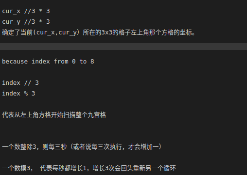

# 37. Sudoku Solver

[LeetCode 37](https://leetcode.com/problems/sudoku-solver/)


## Methods
dfs + brute force 
### Method 1


### Key Points


### Code
```java
public class Sudoku_Solver {
    public void solveSudoku(int[][] board) {
        dfs(board, 0 , 0);
    }

    private boolean dfs(int[][]board, int x, int y){
        int nextY = y == 8? 0 : y + 1;
        int nextX = nextY == 0? x + 1 : x;

        //terminal condition
        if (x == 9 && y == 0) return true;


        // if current is not null
        if (board[x][y] != 0){
            return dfs(board, nextX, nextY);

            // if current is null
        }else {
            for (int i = 1;i < 10 ;i++ ){ //try it from 1 to 9
                board[x][y] = i;
                if (!check(board, x, y, i)) continue;
                if (dfs(board, nextX, nextY)) return true;
            }
            // if all value is invalid, last level maybe wrong
            board[x][y] = 0;
            return false;
        }

    }


    private boolean check(int[][]board, int curX, int curY, int curNum){
        //if valid return true, ohterelse return false

        //check the same row
        for (int j = 0; j < 9; j++){
            if (j == curY) continue;
            if (board[curX][j] == curNum) return false;
        }

        //check the same col
        for (int i = 0; i < 9; i++){
            if (i == curX) continue;
            if (board[i][curY] == curNum) return false;
        }

        //check 3*3 box
        for (int index = 0; index < 9; index++){
            int row = curX / 3 * 3 + index / 3;
            int col = curY / 3 * 3 + index % 3;
            if (curX != row && curY != col && board[row][col] == curNum) return false;
        }

        return true;
    }
}


```


## Reference