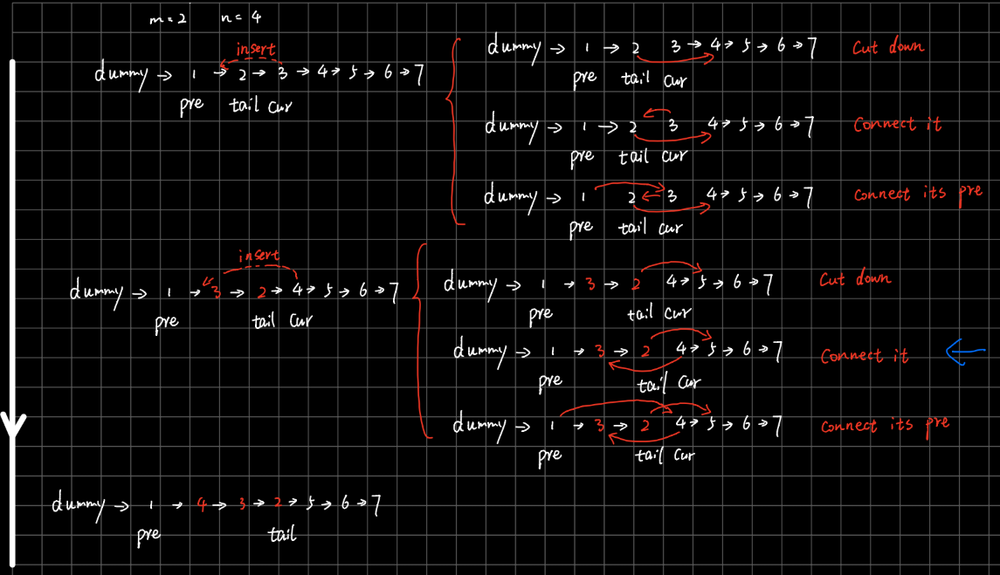

# 92. Reverse Linked List II    

[LeetCode 92](https://leetcode.com/problems/reverse-linked-list-ii/)


## Methods
There are 3 methods to reverse the linkeList from m to n
1. iterator 
2. recursion 
3. insert (best method)
### Method 1
recursion:

let the m node is `head`, let the n node is `tail`, let `pre` be the previous node of `head` and `end` is `tail.next` node


use recursion method to reverse the `reverse part in picture`, then connect `pre 1` to `tail 4` and connect `head 2` to `tail 4`

### Key Points


### Code
```java
public class Solution {
    /**
     * @param head: ListNode head is the head of the linked list 
     * @param m: An integer
     * @param n: An integer
     * @return: The head of the reversed ListNode
     */
    public ListNode reverseBetween(ListNode head, int m, int n) {
        // write your code here
        ListNode dummy = new ListNode(0);
        dummy.next = head;
        ListNode pre = dummy; 
        ListNode end = dummy;
        
        //confirm pre, end, head nodes' position
        for (int i = 1; i <= n+1; i++){
            if (i < m){
                pre = pre.next;     
            }
            end = end.next; 
        }
        head = pre.next;
        
        //connect pre -> tail and reverse linkedlist from m to n
        pre.next = helper(pre.next, m, n);
        // connect head --> end
        head.next = end;  
        
        return dummy.next;
        
    }
    private ListNode helper(ListNode node, int m, int n){
        if (m == n) return node; 
        ListNode tail = helper(node.next, m + 1, n);
        node.next.next = node;
        node.next = null; 
        
        return tail; 
    }
}

```
---------------
### Method 2
iterator method 


### code

```python

class Solution:

    def reverseBetween(self, head, m, n):
         
        dummy = ListNode(None, head)
        m_prev = self.findkth(m-1, dummy)  # bug1:  head is dummy 
        m_node = m_prev.next 
        
        n_node = self.findkth(n, dummy)
        n_next = n_node.next 
        
        n_node.next = None  #let the node -->null
        
        self.reverse(m_node)
        
        m_prev.next = n_node #connect m_pre --> n_node
        m_node.next = n_next #connect m --> n.next node 
        
        return dummy.next  
      
        def reverse(self, node): #reverse whole linkedlist 
            pre = None 
            while node != None:
                nextNode = node.next 
                node.next = pre 
                pre = node 
                node = nextNode
         
        return pre 
            
            
            
    def findkth(self, k, head):
         
        for _ in range(k):
            if not head:
                return None 
            head = head.next 
        return head
```
### Method 3



every time, insert `then` between `pre` and `pre.next`, and keep moving `then` forward by 1

the role of `cur` is to keep forward so as to confirm the position of `then` :`cur.next = then`

### Key Points

1. every time, after swapping `cur` and `then`, the `cur` will move forward 1. there is need to use `cur = cur.next` to move it; 
2. when reverse(shown in the picture as the blue arrow ) , it is not `then.next = cur.next` but `then.next = pre.next`

### code

```java

class Solution {
    public ListNode reverseBetween(ListNode head, int m, int n) {
        ListNode dummy = new ListNode(0); 
        dummy.next = head; 
        ListNode pre = dummy;
        
        //confirm position of pre
        for(int i = 0;i < m-1; i++) pre = pre.next; 
        
        //confirm cur and then
        ListNode cur = pre.next;
        ListNode then = cur.next;
        
        //reverse
        for(int i =0; i < n - m; i++){ //operate n - m times
            //swap
            cur.next = then.next; //cut
            then.next = pre.next; // connect it; it is not `then.next = cur.next`
            pre.next = then;      // connect its pre
            
            //re-locate then; we don't need to move cur, because after swap, cur has been moved
            then = cur.next;
        }
        
        return dummy.next;
    }
}
```


## Reference
https://www.youtube.com/watch?v=wk8-_M-2fzI&t=115s