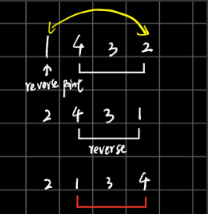

## 31. Next Permutation

[LeetCode 31](https://leetcode.com/problems/next-permutation/)


## Methods

### Method 1
from the tail to the head to find the first non-descending number, named it as `exchangeIndex1`.

Then find the first bigger number than `exchangeIndex1` from tail of array named `exchangeIndex2`, exchange them

Then reverse all subarray behead of `exchangeIndex1`

### Key Points


### Code
```java
public class Next_Permutation {
    public void nextPermutation(int[] nums) {
        if (nums.length == 1) return;

        //find  the first non-descending number
        int exchangeIndex1 = nums.length - 2;
        while(exchangeIndex1 >= 0 && nums[exchangeIndex1] >= nums[exchangeIndex1+1]){
            exchangeIndex1--;
        }

        // If such arrangement is not possible, 
        // it must rearrange it as the lowest possible order (ie, sorted in ascending order).
        if (exchangeIndex1 == -1){
            Arrays.sort(nums);
            return;
        }

        int exchangeIndex2 = nums.length -1;
        while(exchangeIndex2 > exchangeIndex1 && nums[exchangeIndex2] <= nums[exchangeIndex1]){
            exchangeIndex2--;
        }

        //swap nums[exchangeIndex1] with nums[exchangeIndex2]
        int temp = nums[exchangeIndex1];
        nums[exchangeIndex1] = nums[exchangeIndex2];
        nums[exchangeIndex2] = temp;

        // reverse the elements after the index of exchangeIndex2
        int left = exchangeIndex1 + 1, right = nums.length -1;
        while (left < right){
            int tem = nums[left];
            nums[left] = nums[right];
            nums[right] = tem;
            left++;
            right--;
        }


    }
}


```


## Reference
https://www.youtube.com/watch?v=zGQq3HGBTXg

