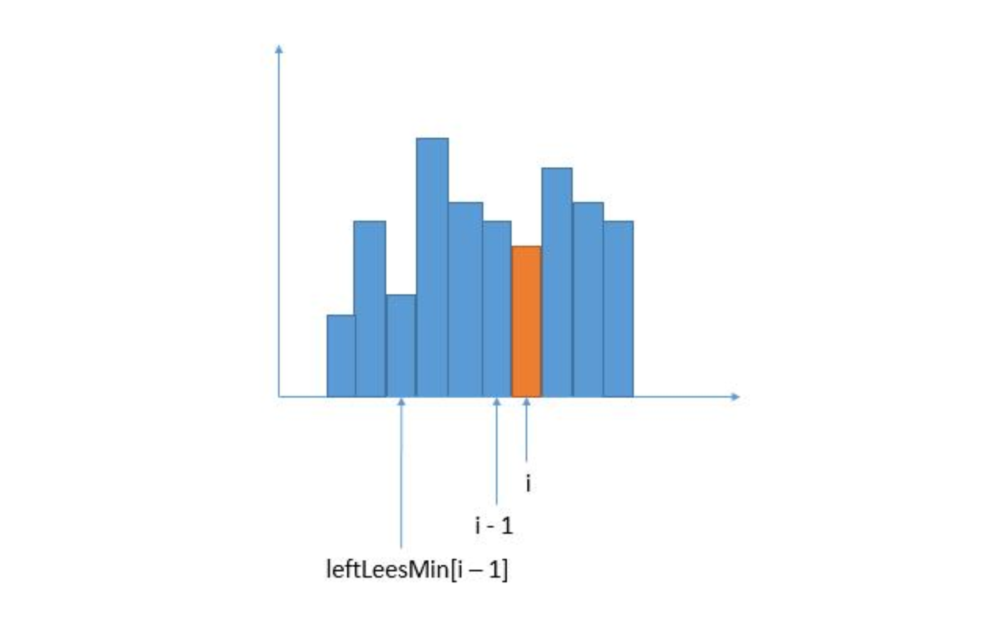

# 84. Largest Rectangle in Histogram

[LeetCode 84](https://leetcode.com/problems/largest-rectangle-in-histogram/)


## Methods

### Method 1
* `Time Complexity`: O(n^2) 
* `Intuition`: brute force
* `Algorithm`: 

First, consider the `brute force`:
 
for every `height[i]` need to find a `leftBound` that height shorter than `height[i]` and `rightBound` shorter than `height[i]`
then `area = (rightBound - leftBound - 1) * height[i]` 
 time complexity O(n^2)
 
```java
public class Solution {

    public int largestRectangleArea(int[] heights) {
        int len = heights.length;
        // 特判
        if (len == 0) {
            return 0;
        }

        int res = 0;
        for (int i = 0; i < len; i++) {

            // 找左边最后 1 个大于等于 heights[i] 的下标
            int left = i;
            int curHeight = heights[i];
            while (left > 0 && heights[left - 1] >= curHeight) {
                left--;
            }

            // 找右边最后 1 个大于等于 heights[i] 的索引
            int right = i;
            while (right < len - 1 && heights[right + 1] >= curHeight) {
                right++;
            }

            int width = right - left + 1;
            res = Math.max(res, width * curHeight);
        }
        return res;
    }
}
```
so the target becomes how to find the `leftBound` and `rightbound` more efficiently.
 
### Method 2
* `Time Complexity`: O(n) 
* `Intuition`: use 2 arrays `leftLess` and `rightLess` to store every element left height less than it and right height less than it 
* `Algorithm`: 

use 2 arrays `leftLess` and `rightLess` to store every element left height less than it and right height less than it
how to build `leftLess[]` ? 

set the `leftLess` store the index
```
leftLess[0] = -1;//there is no left bar at the first bar so set the first ele -1              
for (int i = 1; i < heights.length; i++) {              
    int p = i - 1;
    //p keep reducing so as to let height[p] < height[i] 
    while (p >= 0 && height[p] >= height[i]) {
        p--;
    }
    leftLess[i] = p;              
}
```
the time complexity is O(n^2), we could optimize it. 
 
for current index `i`, if `height[i-1]` is taller than it, we could find `p` from `leftLess[i-1]`.
```  
int[] leftLess = new int[heights.length];
leftLessMin[0] = -1;
for (int i = 1; i < heights.length; i++) {
    int l = i - 1;
    //当前柱子更小一些，进行左移
    while (l >= 0 && heights[l] >= heights[i]) {
        l = leftLess[l];
    }
    leftLess[i] = l;
}

```


### Code
```java
class solution {
public int largestRectangleArea(int[] heights) {
    if (heights.length == 0) {
        return 0;
    }
    //求每个柱子的左边第一个小的柱子的下标
    int[] leftLessMin = new int[heights.length];
    leftLessMin[0] = -1;
    for (int i = 1; i < heights.length; i++) {
        int l = i - 1;
        while (l >= 0 && heights[l] >= heights[i]) {
            l = leftLessMin[l];
        }
        leftLessMin[i] = l;
    }

    //求每个柱子的右边第一个小的柱子的下标
    int[] rightLessMin = new int[heights.length];
    rightLessMin[heights.length - 1] = heights.length;
    for (int i = heights.length - 2; i >= 0; i--) {
        int r = i + 1;
        while (r <= heights.length - 1 && heights[r] >= heights[i]) {
            r = rightLessMin[r];
        }
        rightLessMin[i] = r;
    }

    //求包含每个柱子的矩形区域的最大面积，选出最大的
    int maxArea = 0;
    for (int i = 0; i < heights.length; i++) {
        int area = (rightLessMin[i] - leftLessMin[i] - 1) * heights[i];
        maxArea = Math.max(area, maxArea);
    }
    return maxArea;
}
}
```

### Method 3
* `Time Complexity`: O(n) 
* `Intuition`: monotonic stack. use `stack` to simulate `leftLess` and current index `i` is the `rightBound`
* `Algorithm`: 
    * `area = (rightBound - leftBound - 1) * height`
    * optimize the method 2. In order to optimize the `leftLess[]` and `rightLess[]`, we could combine them. let current `i` is the `rightBound`, `stack.peek()` is the height, the second stack peek is the `leftBound`
    * stack peek is the `height` , so `height = stack.getLast()` 
    * `leftBound` and `rightBound` are not include in area 
    * need to guarantee `height > Min(height[leftBound], height[rightRbound])`   

### Code 

```java
public class Solution {
    public int largestRectangleArea(int[] heights) {
        int maxArea = 0;
        Deque<Integer> stack = new ArrayDeque<>();
        int p = 0;
        while (p < heights.length) {
            //if stack is null, push current index into stack
            if (stack.isEmpty()) {
                stack.add(p);
                p++;
            } else { // if stack is not null 
                int top = stack.peek();
                //当前高度大于栈顶，入栈
                if (heights[p] >= heights[top]) {
                    stack.push(p);
                    p++;
                } else {
                    // when heights[p] < heights[top], p is rightBound 
                    //保存栈顶高度
                    int height = heights[stack.pop()];
                    //左边第一个小于当前柱子的下标
                    int leftLessMin = stack.isEmpty() ? -1 : stack.peek();
                    //右边第一个小于当前柱子的下标
                    int RightLessMin = p;
                    //计算面积
                    int area = (RightLessMin - leftLessMin - 1) * height;
                    maxArea = Math.max(area, maxArea);
                }
            }
        }
        while (!stack.isEmpty()) {
            //保存栈顶高度
            int height = heights[stack.pop()];
            //左边第一个小于当前柱子的下标
            int leftLessMin = stack.isEmpty() ? -1 : stack.peek();
            //右边没有小于当前高度的柱子，所以赋值为数组的长度便于计算
            int RightLessMin = heights.length;
            int area = (RightLessMin - leftLessMin - 1) * height;
            maxArea = Math.max(area, maxArea);
        }
        return maxArea;
    }
}
```

## Reference
[video](https://leetcode-cn.com/problems/largest-rectangle-in-histogram/solution/zhu-zhuang-tu-zhong-zui-da-de-ju-xing-by-leetcode-/)

[A Chinese Blog](https://leetcode.wang/leetCode-84-Largest-Rectangle-in-Histogram.html)