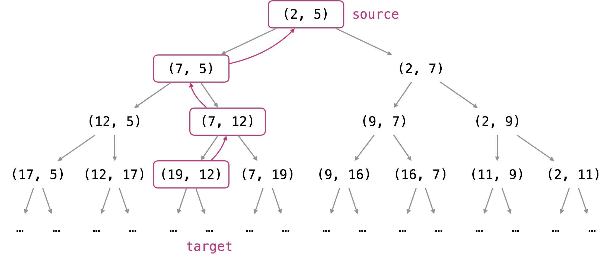

# 780. Reaching Points

[LeetCode 780](https://leetcode.com/problems/reaching-points/)


## Methods

### Method 1
* `Time Complexity`: `O(logN)`
* `Intuition`: 
    
    *  `sx, sy, tx, ty` is positive number
    * If we start from `sx,sy`, it will be hard to find `tx, ty`.
    * If we start from `tx,ty`, we can find only one path to go back to `sx, sy`.
    * If `tx < ty`, the parent must be `(tx, ty - tx)`. If `tx > ty`, the parent must be `(tx - ty, ty)`     
    
* `Key Points`: 
* `Algorithm`: 


### Code
* `Code Design`: 

```java
class Solution {
    // this Method will TLE
    public boolean reachingPoints(int sx, int sy, int tx, int ty) {
        while (tx >= sx && ty >= sy) {
            if (sx == tx && sy == ty)
                return true;
            if (tx > ty) tx -= ty;
            else ty -= tx;
        }
        return false;
    }
    
    // optimize 
    public boolean reachingPoints(int sx, int sy, int tx, int ty) {
        while (tx > sx && ty > sy) {
            if (tx > ty) {// parent is (tx - ty, ty)
                tx %= ty; // after that, tx < ty
            } else {
                ty %= tx;
            }
        }
        // if (sx == tx), from current node to root, just do (tx, ty - k * tx).
        if (sx == tx && ty >= sy && (ty - sy) % sx == 0) return true;
        // if (sy == ty), from current node to root, just do (tx - k * ty, ty).
        if (ty == sy && tx >= sx && (tx - sx) % sy == 0) return true;
        return false;
    }
}
```


## Reference

[LeetCode Explain](https://leetcode.com/problems/reaching-points/discuss/375429/Detailed-explanation.-or-full-through-process-or-Java-100-beat)
[YouTuBe](https://www.youtube.com/watch?v=1E39PiQAGvE&t=511s)
