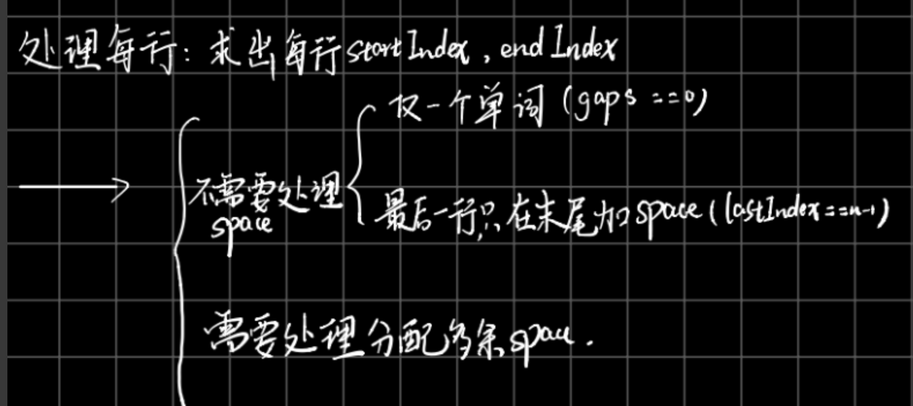

# 68. Text_Justification

[LeetCode 68](https://leetcode.com/problems/text-justification/)


## Methods

### Method 1
* `Time Complexity`: 
* `Intuition`:
* `Algorithm`:  
1. we handle every line. For every line, we use `startIndex` to denote the start word's index and `endIndex` denotes the index of end word.

2. Then discussion by situation: 
    1. if the row just has one word, or it's the last row
    2. if it is a common row 
       

### Key Points


### Code
```java
class Solution {
    public List<String> fullJustify(String[] words, int maxWidth) {

        List<String> res = new ArrayList<>(); 
    
        // we deal with this this problem by handling every line 
        // for every line, need to confirm the startIndex and endIndex 
        int startIndex = 0;
        while (startIndex < words.length) {
            // for every line: 
            int endIndex = startIndex + 1; 
            int curWordsLen = words[startIndex].length(); 
            while (endIndex < words.length && curWordsLen + 1 + words[endIndex].length() <= maxWidth) {
                curWordsLen += 1 + words[endIndex].length(); 
                endIndex++; 
            }
            endIndex--; // don't forget minus 1 
            // now we get the startIndex and endIndex of one line
            
            StringBuffer sb = new StringBuffer(); 
            // if the line just has one word, or it is the last line 
            if (endIndex == startIndex || endIndex == words.length - 1) {
                while(startIndex != endIndex) {
                    sb.append(words[startIndex]); 
                    sb.append(" "); 
                    startIndex++; 
                }
                sb.append(words[endIndex]); // don't forget the endIndex; 
                
                //add space to the end of the line 
                while (sb.length() < maxWidth) sb.append(" "); 
            }else { // if current line has more than 1 words 
                // extra space for every gap 
                int space = (maxWidth - curWordsLen) / (endIndex - startIndex); //now every word gap has one space, but we need to get the extra space for every word gap 
                int rest = (maxWidth - curWordsLen) % (endIndex - startIndex); // how many onespace rest 
                for (int i = startIndex; i < endIndex; i++) {
                    sb.append(words[i]); 
                    sb.append(" "); // add one space first  
                    sb.append(" ".repeat(space)); //add extra space 
                    if (rest > 0) sb.append(" "); 
                    rest--;
                }
                sb.append(words[endIndex]); // don't forget the endIndex ;
            }
            res.add(sb.toString()); 
            startIndex = endIndex + 1; 
        }
        return res; 

    }
}

```


## Reference