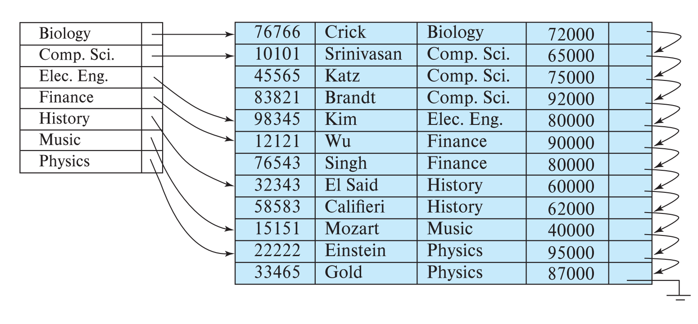
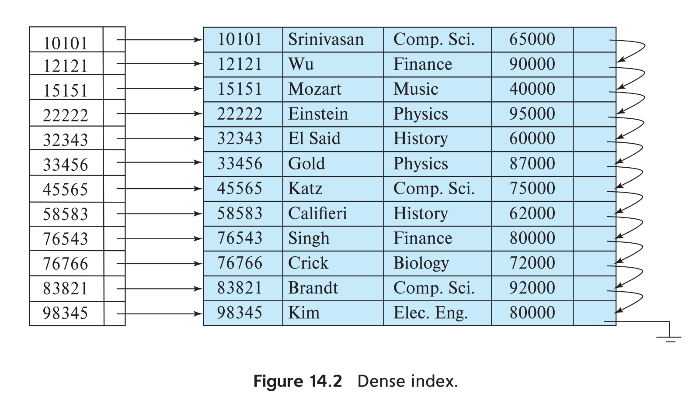
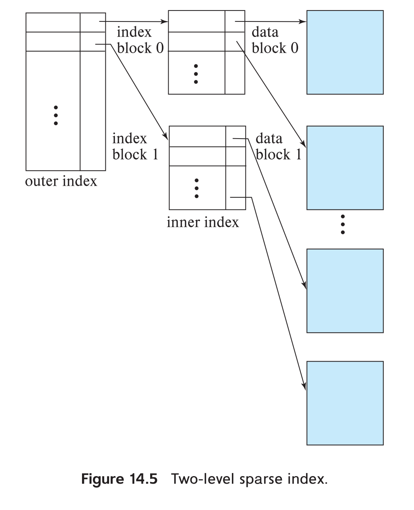
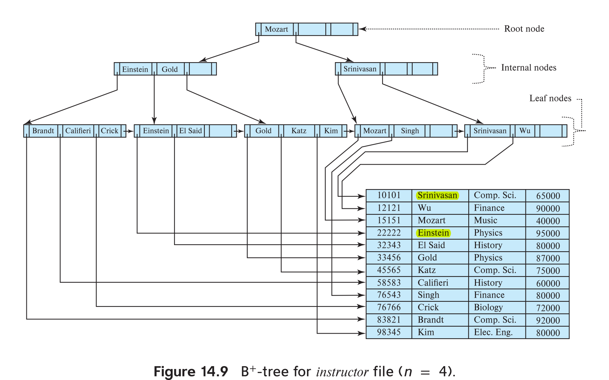

# Indexing 
indices in database just like indices in textbook. Without indices, every query would end up reading the entire contents of every relation that it uses; doing so would be unreasonably expensive for queries that only fetch a few records, for example, a single student record, or the records in the takes relation corresponding to a single student.

There are two basic kinds of indices:

* **Ordered indices**: Based on a sorted ordering of the values.   
* **Hash indices**: Based on a uniform distribution of values across a range of buckets. The bucket to which a value is assigned is determined by a function, called a hash function.
* **B+-Tree indices**

 search key: An attribute or set of attributes used to look up records in a file is called a **search key**.
for the picutre blow, search key is `apt_name` and `id` 
 
 
 

## Ordered Indices
There are two types of ordered indices that we can use:
* dense index: In a dense index, an index entry appears for every search-key value in the file

* sparse index: In a sparse index, an index entry appears for only some of the search-key values 

* noncluster index: Indices whose search key specifies an order different from the sequential order of the file are called **nonclustering
indices**, or secondary indices. 
* cluster index: search key is ordered 

### multiply indices
sparse index may alse large. so we use `outer index` and `inner index` to build multiply index

### non-cluster indices 
Secondary indices must be dense, with an index entry for every search-key value, and a pointer to every record in the file. 

## B+ Tree Indices 
The main disadvantage of the index-sequential file organization is that performance degrades as the file grows, both for index lookups and for sequential scans through the data.
so, introduce the b+ tree indices 

* it is efficient for maintain to delete and insert data 
* A B+-tree index takes the form of a balanced tree in which every path from the root of the tree to a leaf of the tree is of the same length.
* Each nonleaf node in the tree (other than the root) has between [n∕ 2] and n children, where n is fixed for a particular tree;  
* it increases the insert and delete overhead but avoid reorganization

we could take `instructor` table as example, `search key` is the `name`

every node has `search key` and `pointer` point to other children node's `search-key`

These examples of B+-trees are all balanced. That is, the length of every path from the root to a leaf node is the same.  

*[difference between b tree and b+ bree](https://stackoverflow.com/questions/870218/what-are-the-differences-between-b-trees-and-b-trees#:~:text=Since%20you%20can%20elevate%20commonly,to%20get%20to%20the%20data.&text=In%20a%20B%20tree%20search,are%20found%20in%20leaf%20nodes.)

## Hash Indices 
* In our description of hashing, we shall use the term **bucket** to denote a unit of storage that can store one or more records

