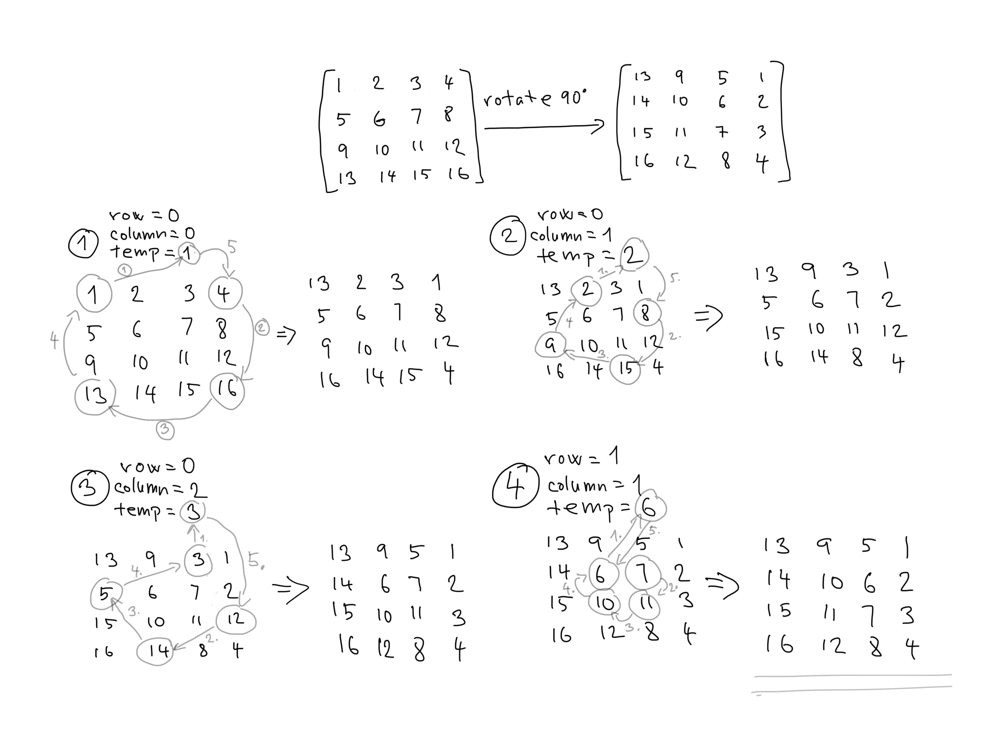

# 48. Rotate Image

[LeetCode 48](https://leetcode.com/problems/rotate-image/)


## Methods

### Method 1
```
 clockwise rotate
 first reverse up to down, then swap the symmetry 
  1 2 3     7 8 9     7 4 1
  4 5 6  => 4 5 6  => 8 5 2
  7 8 9     1 2 3     9 6 3

 anticlockwise rotate
 first reverse left to right, then swap the symmetry
 1 2 3     3 2 1     3 6 9
 4 5 6  => 6 5 4  => 2 5 8
 7 8 9     9 8 7     1 4 7
```

### Key Points


### Code
```java

public class Solution {
    /**
     * @param matrix: a lists of integers
     * @return: nothing
     */
    public void rotate(int[][] matrix) {
    /*
     * clockwise rotate
     * first reverse up to down, then swap the symmetry 
     * 1 2 3     7 8 9     7 4 1
     * 4 5 6  => 4 5 6  => 8 5 2
     * 7 8 9     1 2 3     9 6 3
    */
        //reverse 
        for (int i = 0; i < matrix.length / 2; i++) {
            for (int j = 0; j < matrix[0].length; j++) {
                int temp = matrix[i][j]; 
                matrix[i][j] = matrix[matrix.length - i - 1][j];
                matrix[matrix.length - i - 1][j] = temp; 
            }
        }
        //swap the symmetry
        for (int i = 0; i< matrix.length; i++) {
            for (int j = 0; j < i + 1; j++){
                int temp = matrix[i][j];
                matrix[i][j] = matrix[j][i];
                matrix[j][i] = temp; 
            }
        }
        
    }
}
```
### Method 2

just scan the matrix once


### Code
```java
public class Solution {
    public void rotate(int[][] matrix) {
        int n=matrix.length;
        for (int i=0; i<n/2; i++) 
            for (int j=i; j<n-i-1; j++) {
                int tmp=matrix[i][j];
                matrix[i][j]=matrix[n-j-1][i];
                matrix[n-j-1][i]=matrix[n-i-1][n-j-1];
                matrix[n-i-1][n-j-1]=matrix[j][n-i-1];
                matrix[j][n-i-1]=tmp;
            }
    }
}
```

## Reference